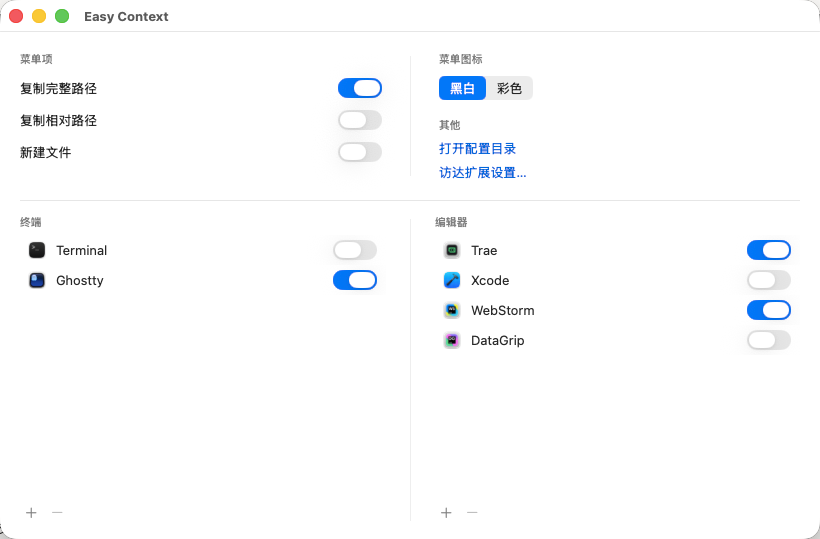
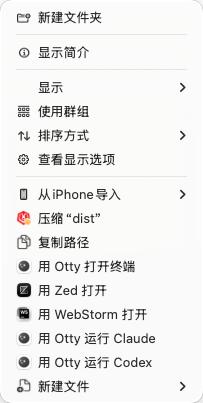

# Easy Context

给 macOS **访达（Finder）右键菜单**加上日常高频操作：复制路径、用终端 / 编辑器打开当前目录、新建文件等。灵感来自 EasyNewFile，但更现代、更可配置、支持各类主流终端与 AI 编辑器。

> 纯原生 Swift / SwiftUI + FinderSync 扩展。本地自用，ad-hoc 签名即可运行。

## 截图

| 设置 | 右键菜单 |
|---|---|
|  |  |

## 功能

- **复制完整路径** / **复制相对路径**（相对最近的 `.git` 仓库根，不在仓库内回退 `~`）
- **用终端打开**当前目录 —— 自动识别 Terminal、iTerm、Warp、Otty、Ghostty、cmux、Muxy、kitty、WezTerm、Alacritty、Hyper、Tabby、Rio、Wave、Termius
- **用编辑器打开**当前目录 —— VS Code、VSCodium、Cursor、Trae、Devin（原 Windsurf）、CodeBuddy、Zed、Sublime Text、Nova、BBEdit、TextMate、MacVim、Emacs、Xcode、JetBrains 全家桶（WebStorm / IntelliJ IDEA〔含 CE〕/ PyCharm〔含 CE〕/ GoLand / CLion / PhpStorm / RubyMine / Rider / DataGrip / Fleet）、Android Studio 等
- **在终端运行命令**（`用 XX 运行 YY`）—— 一键在**执行终端**里于当前目录运行 AI CLI 等命令（预置 `claude` / `codex`，可自定义增删）
- **新建文件** —— 子菜单选模板（Markdown / 文本 / Shell / JSON），弹**命名面板**输入文件名（预选基名、保留扩展名；重名自动加序号、`.sh` 自动加可执行位），创建后在 Finder 中选中
- **多语言支持** —— 自动跟随系统语言切换，支持简体中文、English、繁體中文、日本語、Deutsch、Français、Español 7 种语言
- **内置盘 + 外置磁盘**都生效
- **可配置设置界面**：选择菜单显示哪些终端 / 编辑器、管理自定义命令、选执行终端、`+` 自定义添加未识别的 App、菜单图标黑白 / 彩色、深色模式自动适配

多选目标规则：复制完整路径 / 相对路径会复制所有选中项；打开终端 / 打开编辑器会把目录取自身、文件取父目录后按路径去重，并打开这些目录；运行命令 / 新建文件是一次性动作，使用去重后的第一个目录。

## 安装

> 应用为 ad-hoc 签名、**未做 Apple 公证**，首次打开安装包需手动允许一次（详见 [`packaging/安装说明.txt`](packaging/安装说明.txt)）。

1. **右键**点 `EasyContext.pkg` →「打开」→ 弹窗再点「打开」（不签名安装包直接双击会被拦，用右键打开这一次即可）。
2. 按安装向导点「继续 / 安装」，输入密码授权装到「应用程序」。装完 App 会自动启动；重装 / 更新时安装程序会**自动关闭旧版本**，无需手动退出、也不会再报「正在使用中」。
3. 启用扩展：打开 EasyContext，点顶部横幅「去启用」，或
   **系统设置 → 通用 → 登录项与扩展 → 访达扩展 → 勾选 EasyContextFinder**。
4. 在访达里右键任意文件 / 文件夹即可使用。

> pkg 装出来的 App 不带隔离标记，**无需再执行 `sudo xattr -dr com.apple.quarantine`**。命令行安装可用 `sudo installer -pkg EasyContext.pkg -target /`。

## 配置

两种方式，读写同一份配置：

- **图形界面**：打开 EasyContext，勾选要显示的 App、调整菜单图标风格等。
- **手改配置文件**：`~/.easy-context/config.json`，修改即时生效——扩展按文件修改时间智能重读；宿主设置窗在切回（App 重新激活）时也会自动重读外部改动。

配置文件结构：

```jsonc
{
  "version": 3,
  "items": { "copyFullPath": true, "copyRelativePath": true, "newFile": true },
  "terminals": [
    { "bundleId": "com.apple.Terminal", "name": "Terminal", "custom": false, "enabled": true }
  ],
  "editors":  [ /* 同结构 */ ],
  "commands": [                                     // 「用 XX 运行 YY」的命令
    { "id": "…uuid…", "name": "Claude", "command": "claude", "enabled": true }
  ],
  "defaultTerminal": null,                          // 执行终端 bundleId；null=第一个可用终端
  "terminalTemplates": {},                          // 终端启动模板的“用户覆盖”，空=全用内置
  "appearance": { "appIconStyle": "monochrome" }    // monochrome | color
}
```

- 终端 / 编辑器的 `enabled` 控制**是否在右键菜单显示**；`custom: true` 为用户自行添加的 App。
- 启动时、以及每次切回设置窗（App 重新激活）时，都会自动并入新检测到的内置 App、去重并排序（内置在前、自定义在后），并保留你的开关与自定义项——运行期新装的内置 App 切回设置窗即出现，**无需重启**。
- 设置列表只展示**已安装**的 App；卸载后条目仍保留在配置里（开关状态不丢、重装自动回来），只是不在列表显示。

### 在终端运行命令

- 右键菜单出现 `用 <执行终端> 运行 <命令名>`（如 `用 Terminal 运行 Claude`），在**当前目录**打开终端并运行该命令。多选跨目录时只作用于去重后的**第一个目录**（一个终端窗口）。
- **执行终端 ≠ 菜单显示**：执行终端是「命令在哪跑」，与「菜单显示的终端」开关无关，条件是**已安装且有启动模板**——内置模板覆盖 Terminal / iTerm / Ghostty / cmux / Otty / Muxy / kitty / WezTerm / Alacritty；其余（Warp、Hyper 等）需在 `terminalTemplates` 自行添加模板后才会进入候选。设置界面「执行终端」下拉即列出这些可用终端，`defaultTerminal` 为 `null` 时取第一个（系统 Terminal 兜底）。
- **PATH**：GUI 进程 PATH 精简，`-e` 型终端（kitty/WezTerm/Alacritty）经用户登录 shell `$EC_SHELL -lic <cmd>` 运行，确保能找到 `~/.local/bin` 等里的 `claude`/`codex`。Terminal/iTerm/Ghostty/cmux/Otty 用 AppleScript 把命令输入交互 shell，PATH 天然正确。
- **自定义启动模板**：`terminalTemplates` 只存**覆盖**（空 = 用内置）。想改某终端：参照配置目录里自动生成的 **`terminal-templates.reference.json`**（列出全部内置模板与 bundleId），把对应条目复制到 `terminalTemplates` 修改。占位符 `{dir}`/`{cmd}` 会替换为 `"$EC_DIR"`/`"$EC_CMD"`（值只走环境变量，勿自行加引号），可用 `$EC_SHELL`。
- **Ghostty / cmux / Terminal / iTerm / Otty** 用 AppleScript 运行命令（把命令输入交互 shell，非 `-e` 执行）：无「Allow execute」弹框、PATH 正确；仅**首次**需一次性授权「EasyContext 控制 <终端>」（macOS 自动化权限）。Ghostty 需 1.3.0+；cmux 使用其官方 Scripting Dictionary 新建 workspace 并向 focused terminal 发送命令。
- **Muxy** 使用官方 CLI：先在 Muxy 菜单执行 **Muxy → Install CLI**。Easy Context 会先用 `muxy <目录>` 打开或选中项目；首次打开时复用 Muxy 自动创建的初始终端 tab，项目已打开时只新建一个命令 tab，然后发送命令并回车。Muxy 冷启动时会等待其本地控制服务就绪。

## 从源码构建

依赖：完整版 **Xcode**、[**XcodeGen**](https://github.com/yonaskolb/XcodeGen)（`brew install xcodegen`）。

```bash
# 生成工程并构建（Debug）
xcodegen generate
xcodebuild -project EasyContext.xcodeproj -scheme EasyContext -configuration Debug \
  -derivedDataPath build CODE_SIGN_IDENTITY="-" CODE_SIGNING_REQUIRED=YES \
  CODE_SIGNING_ALLOWED=YES ENABLE_DEBUG_DYLIB=NO build

# 纯逻辑层单元测试
cd EasyContextCore && swift test

# 打包成分发用 .pkg（安装时自动关旧进程/扩展、装出的 App 免清 quarantine）
./scripts/build-pkg.sh   # 产物：dist/EasyContext.pkg
```

## 架构

- **EasyContextCore**（本地 Swift 包）：纯逻辑（路径解析、App 检测、配置模型 / reconcile、文件模板…），命令行 `swift test` 驱动 TDD。
- **EasyContextFinder**（FinderSync 扩展，沙盒）：注入右键菜单、执行动作。
- **EasyContext**（AppKit 宿主 + SwiftUI 设置界面，非沙盒）：后台代理型 App，手动管窗，处理设置界面、引导启用扩展、执行命令 / 新建文件。
- 宿主与扩展通过共享文件 `~/.easy-context/config.json` 交换配置。

## FinderSync 开发要点（贡献者须知）

这类扩展有不少非显而易见的约束，踩过的坑记录在此，避免重蹈：

- **`menu(for:)` 与菜单点击的动作回调运行在后台 XPC 工作线程，不是主线程**；而 `init()` 与 NSWorkspace 卷挂载/卸载通知在主线程。⚠️ 曾因误加 `assert(Thread.isMainThread)` 到 `menu(for:)`、错误假设它在主线程，导致每次右键扩展崩溃。由此衍生：
  - 跨「工作线程菜单构建」与「主线程卷通知」共享的缓存**必须加锁**（本项目用 `NSLock`，临界区只读写缓存、把读盘/渲染等耗时操作放在锁外；非递归锁，临界区内不得调用其它加锁方法）。
  - 离屏图标绘制用 **bitmap-backed `NSGraphicsContext`**，不要用 `NSImage.lockFocus`（主线程取向的 API，在工作线程属未受支持路径，会偶发失败/崩溃）。
  - 读系统深浅色：手动深浅色模式读全局 **`AppleInterfaceStyle`**（线程安全）；「自动切换」外观下该键不跟随时段翻转，需 `main.sync` 跳主线程读 `NSApp.effectiveAppearance`（主线程属性，工作线程直接取不可靠）。⚠️ 勿在持缓存锁时调用，否则与主线程等锁形成死锁环。
- **扩展必须开启 App Sandbox**（pkd 拒绝非沙盒插件）；本地自用靠 `temporary-exception` entitlement 放行 `/Users//Volumes/` 等文件访问。
- **菜单项的 `representedObject` 会在 XPC 往返中丢失**，故用 `tag` 索引应用列表。
- **打开 App 用 `NSWorkspace.open`**（沙盒禁止 spawn 进程，不能用 `Process`/`open`）；**新建文件用子菜单**选模板、点选后交宿主弹命名面板创建（扩展弹模态 UI 会抛异常）。
- **监控所有挂载卷**（单个 `/` 不覆盖 `/Volumes/*` 外置盘），并监听挂载/卸载/改名动态刷新。
- **Debug 构建须 `ENABLE_DEBUG_DYLIB=NO`**，否则 debug-dylib 桩会让扩展无法独立加载。

## 已知限制

- **分发**：用 `.pkg`（`scripts/build-pkg.sh`）分发——安装出来的 App 不带 quarantine、无需手动清理，且 preinstall 会自动关掉正在运行的旧 App 与 FinderSync 扩展，重装不再报「正在使用中」。不签名的 pkg 首次打开仍需右键→打开放行一次；要做到「双击即装、全程零提示」，需 **Apple Developer ID 证书 + 公证（notarization）**（付费账号，详见 `scripts/build-pkg.sh` 顶部注释）。
- 部分小众 AI 编辑器（PearAI / Void 等）暂无可靠 bundle id，未进内置清单，可用设置界面的 `+` 自行添加。
- **在终端运行命令 / 新建文件**由宿主 App 处理（后台代理，无 Dock 图标；双击 App 才显示配置窗）：首次用 AppleScript 型终端（Terminal / iTerm / Ghostty / cmux / Otty）运行命令时，会弹一次性「控制终端」的自动化授权。
- Warp、Hyper、Tabby、Rio、Wave、Termius 暂无内置启动模板：可在菜单里**打开目录**，但不能作为**执行终端**运行命令，除非在设置的「Templates…」编辑器（或 `terminalTemplates`）里添加模板。
- **外置磁盘在访达侧栏的图标会显示为 EasyContext 的图标**：这是 FinderSync 监控卷根目录（为提供外置盘右键菜单）的系统机制性副作用，与 Dropbox 文件夹在侧栏显示 Dropbox 图标同理，仅影响侧栏显示、不影响磁盘本身；扩展停用后图标即恢复。
- 覆盖安装（升级）时安装器会自动重启访达，以立即挂接新版扩展——否则右键菜单可能消失，直到系统重新扫描注册插件。
